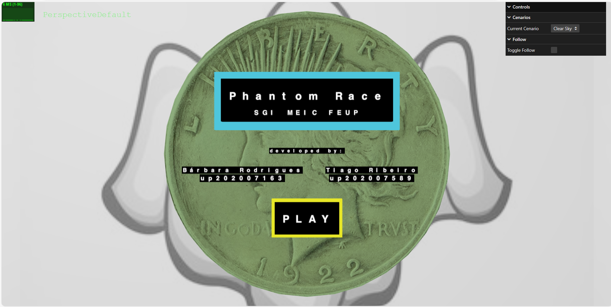
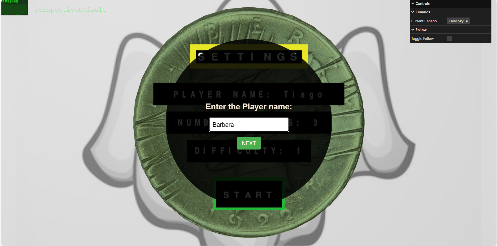
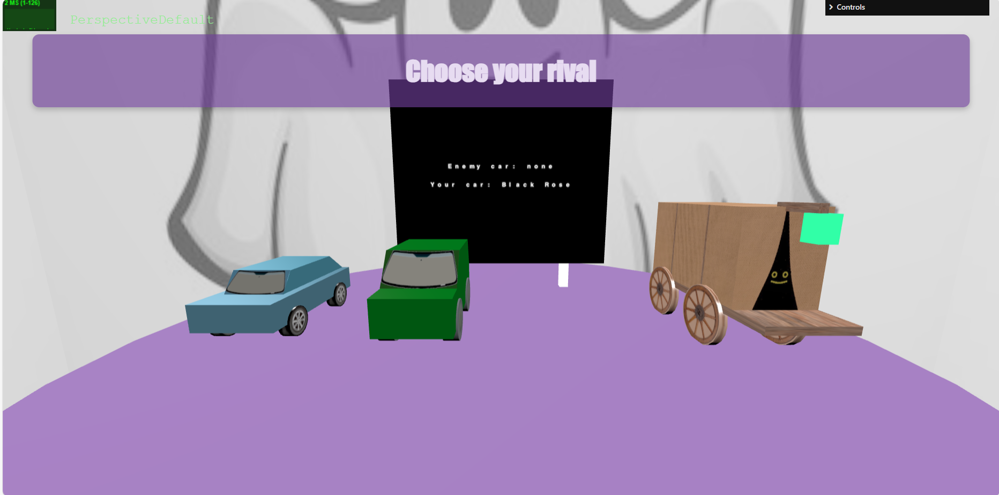
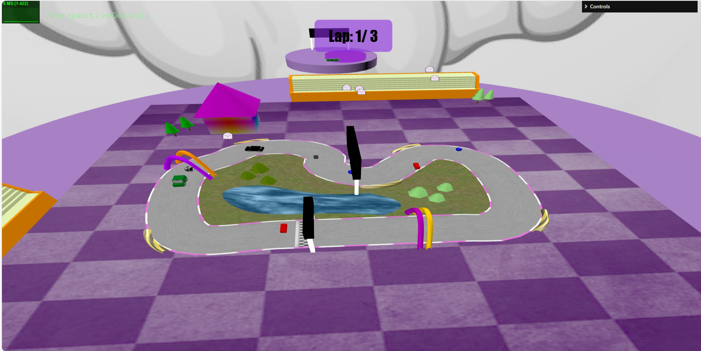
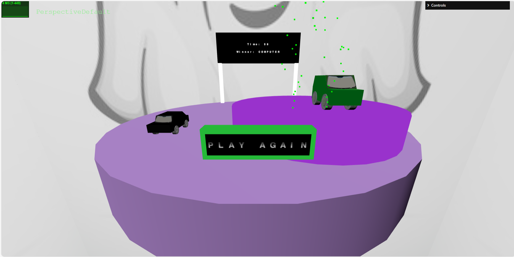
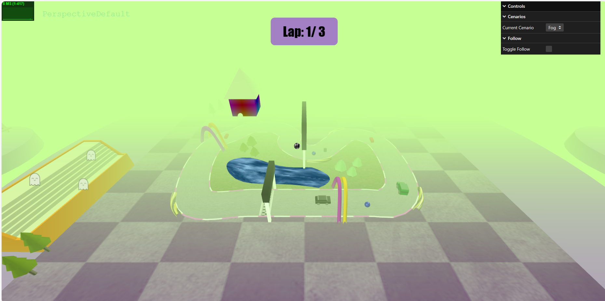

# SGI 2023/2024

## Group T01G03

| Name             | Number    | E-Mail             |
| ---------------- | --------- | ------------------ |
| Bárbara Rodrigues        | 202007163 | up202007163@fe.up.pt  |
| Tiago Ribeiro        | 202007589 | up202007589@fe.up.pt |

----

## Projects

### [TP1 - ThreeJS Basics](tp1)

- Interactive Spotlight above the scene to which the user can modify the color and intensity in the GUI
- Interactive Window to which the user can change the landscape in the GUI
- Interactive PointLight power On and Off in the lamp, to which the user can change it state in the GUI
 

- Scene:
  - In the scene, we can see a table with several objects on top, namely a cake with a candle that illuminates it with a reddish light, a folded newspaper, a red spring and two vases, one of which with dirt inside and a flower. Filling the room, we can see two chairs, a bigger vase with some decoration plants, a standing lamp, that can be turned on and off in the GUI, partially illuminating the wall behind it, a football and a chest. Hovering near the table, there's a red semi-transparent baloon. In the walls surrounding the scene, there's a painting of a beetle car, two photo frames, a window and a door.

  - Relative link to the scene: ./tp1/

- Issues/Problems:

  - We have implemented all the mandatory items
  - No difficulties were found that could not be overcome

-----

### [TP2 - ThreeJS Parser](tp2)

- The GUI allows the user to select from the cameras described in the xml file.

- Video Textures and Bump textures implemented
  - Video texture used on the TV
  - Use of bump textures, namely in the gym towel, so that it appears to be more realistic.
- We have implemented many features to make it easier to render computationally heavy scenes:
  - One example is the use of LOD (level of detail). It's used to render objects based on their distance from the camera. We implement LOD's in the weights, simplifying the shape, in the water bottle, removing the texture and then simplifying the shape too, as well as in the television screen, so it stops showing the video at certain distance
  
  - We've implemented Mipmaps in the gym logo panel: when they're enabled, the GPU will use different sized versions of a texture to render a surface, depending on how far it is from the camera.
  - The Buffer Geometry technique, working on a lower level and sending vertices, normals and colors directly to the GPU, was used for rectangles, boxes, spheres, triangles and polygon geometries.
- Skybox and fog was also implemented

- The GUI has a switch that allows the user to toggle between the "fill" mode and the "wireframe" mode, also facilitating the programmers when debugging.

- Scene:
  - Our scene represents a gym room. Here we can see multiple dumbbells spread all over the floor, as well as a matress. Filling the room, we can see a tipic squat gym machine with a ondulated towel hanged by a weights bar, a jump box of wood, and a free weights bar on the floor.
  - There is also a water bottle lost over a  shelf, illuminated by a lamp with a welcoming light. More in the corner, exists another lamp, this one illuminating the gym zone with a purple light.
  - Fixed to the wall, we have a highlighted panel with the gym logo and a television that shows a simple gym video program.
  - the environment in the gym is slightly foggy and the room is surrounded by a sky box

  - Relative link to the scene: ./tp2/

- Issues/Problems:

  - We had some difficults with texLenght values on textures. Although we made an implementation of it, we are not sure if it's correct.
  - Also LOD's give us some issues in the demo scene provided, but they work fine in our scene.
----

### [TP3 - Car Game](tp3)

- Use of a parser from YASF language to THREE 3D objects
- Menu using 3D techiques implemented, with pressable buttons

- A picker using 3D objects where the user can select the cars and obstacles

- Implementation of a controllable car and an autonomous one that compete in a race where the user can define the number of laps and the speed of the autonomous vehicle.

- Implementation of particles used for fireworks and sprite billboards for the ghost spectators

- Use of textual characters for the textual information presented in the menus and outdoors
- Use of shaders in the lake, clouds and in powerups.
- The GUI allows the user to change the camera used from over the track to 3rd person view from the car and the cenario's weather.

- Collision system that not only detects collisions with obstacles and powerups but also prevents the user's car from going against the enemy car or the cenario objects.

- Scene:
  - Our scene represents a car game in which a human can compete against the computer. It starts with a menu showing the game name and the developers. After pressing 'PLAY' it is shown some game settings to be defined before can start the game. There the player can choose a nickname, define the number of laps of the run and set the difficulty level. When all the things are filled, the player can press 'START' and it is redirectioned to the car parcking zone, where he is able to choose its personal car aspect as well as the computer vehicle.
  - After that, the countdown starts counting and the run starts. There are some obstacles and powerUps spread through the track:
    - the powerUps have a sphere geometry and can be of to types: 'super speed', that enables higher velocity during a limited time (chosen by the player), or 'ghost powerUp', that enables the car not losing its velocity even if it's out of the track, as well as enables goiong throught the automate vehicle (like a ghost), instead of stopping after collision.
    - the obstacles have a box geometry, and as the powerUps, have two different types: 'low speed' is an obstacle that limites the maximum speed of the vehicle for some time, and 'dark drive' makes the player drive without light for a also for a limit time.
    - All the times that the player vehicle collides with a powerUp, it must choose an obstacle and place it in the track, in any valid position.
  - Also during the game it is possible to pause it using the 'Space' key, or to reload the page and start playing again when pressing the 'Escape' key.
  - The game ends when some of the cars reach the finish line of the last lap. After ending up, the camera focus the podium that shows the winner and some game stats.

- Issues/Problems:

  - We had some difficult in start the game again after the game is over, so we only made a window reload to restart the game.
  - We don't have time to implement the shader simulating relief, we can't even start trying to implement it.

